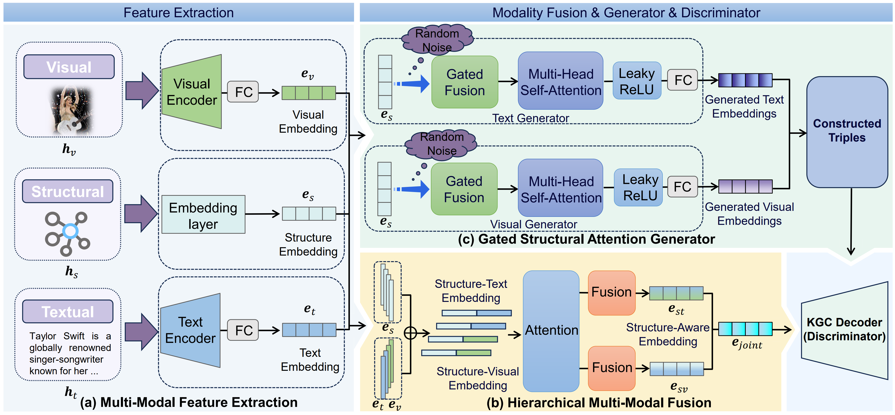

# 

# HiFi: Hierarchical Fusion-based Multi-Modal Knowledge Graph Completion with Structural Attention Generation

## Overview



## Environment

pip install -r requirements.txt

## Data

The datasets consist of DB15K, MKG-W, and MKG-Y, each containing a combination of structural, textual, and image information. Here, we directly present their embeddings. You can download all the datasets from [Google Drive](https://drive.google.com/drive/folders/1rLSqmVdXrHJbSB7On0RPZfrJZAhG2IjT?usp=drive_link). Then put them in the 'embeddings' folder.

## Run

The provided scripts can execute experiments on the DB15K dataset. To train on alternative datasets, adjust the '-dataset' parameter accordingly.

```
CUDA_VISIBLE_DEVICES=0 nohup python HiFi_main.py -dataset=DB15K \
  -batch_size=1024 \
  -margin=6 \
  -epoch=1000 \
  -dim=256 \
  -mu=0 \
  -save=./checkpoint/HiFi \
  -neg_num=128 \
  -learning_rate=1e-5 > result.txt &
```

